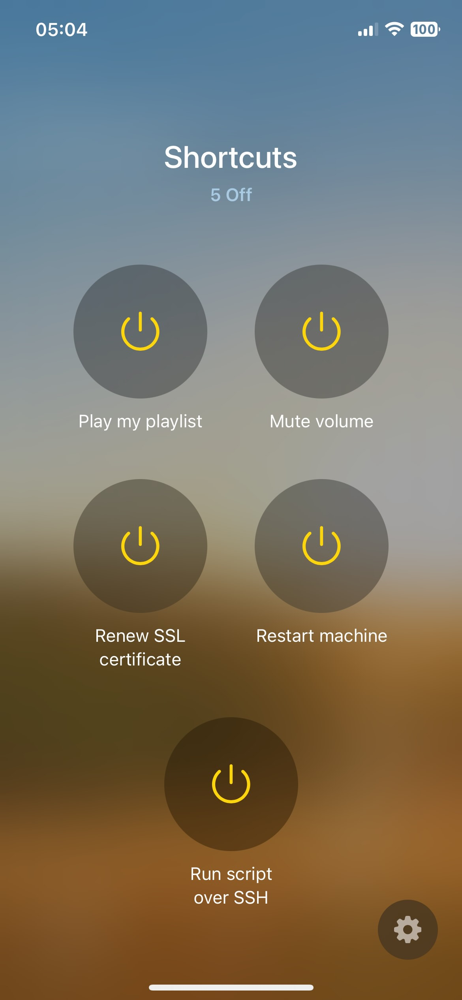
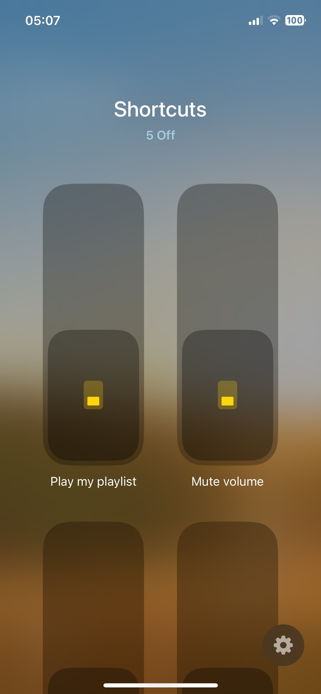
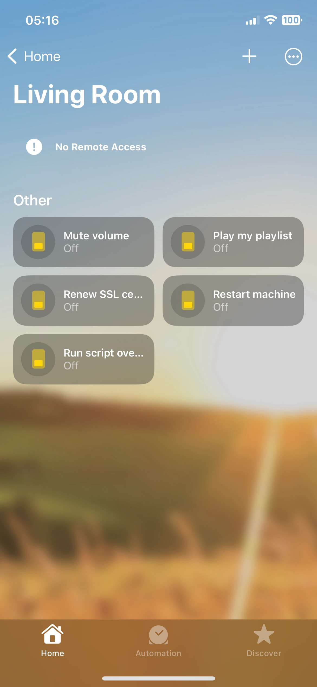

# Homebridge Shortcuts Buttons Plugin

[//]: [](https://github.com/homebridge/homebridge/wiki/Verified-Plugins)

### Features highlights

- Run your Apple Shortcuts directly from your Home (or HomeKit compatible) app.
- Optionally, choose a custom command to execute once the shortcut completes (success/failure/cancel), leveraging an integrated x-callback-url server.
- Choose to display your shortcuts buttons as Outlets or Switches.
- All via UI plugin configuration, no other setup required.
- Super fast and light, with zero package dependencies (a plus just to brag).

### Apple Home preview

&ensp;
&ensp;


<small>a) _Outlets - Single tile (Services view)&emsp;b) Switches - Single tile (Services view)&emsp;c) Switches - Separate tiles (Accessory view)_</small>

## How it works

1. When you tap the button/switch, the plugin executes a command on the machine where Homebridge is running which runs the relevant Apple Shortcut.<br>

   > _There are no restrictions on the content of the shortcuts to run, including ones running scripts over SSH on other hosts. The plugin has no role in this, as it only instructs Shortcuts to run them via native url schema._

2. If you left enabled the option `Wait for shortcut result` (see description [below](#configuration)), the plugin will inform Shortcuts to give a signal back once the shortcut execution is completed.

   > _This is done using the [x-callback-url](https://x-callback-url.com) standard, which effectively appends to the shortcut execution request the instructions on what to do when it succeds, fails, or is canceled._

3. Once the shortcut has been executed the plugin receives the callback and, depending on the status of the shortcut execution, runs the relevant command (either the default callback command or a custom one if provided, see [below](#callback-command)).

   > _This is possible because the plugin includes a (very light) http server running locally within Homebridge, which receives the callback from Shortcuts and determines the next command to run._

## Configuration

| Field                    | Type                                    | Default                          | Description                                                                                                                                                                                                                                                                      |
| ------------------------ | --------------------------------------- | -------------------------------- | -------------------------------------------------------------------------------------------------------------------------------------------------------------------------------------------------------------------------------------------------------------------------------- |
| Name                     | `string`                                | `"Homebridge Shortcuts Buttons"` | Name of the platform bridge.                                                                                                                                                                                                                                                     |
| Accessory name           | `string`                                | `"Shortcuts"`                    | Display name of the accessory.                                                                                                                                                                                                                                                   |
| Display buttons as       | `"Outlet" \| "Switch"`                  | `"Outlet"`                       | Display the buttons services as outlets or as switches.                                                                                                                                                                                                                          |
| Buttons                  | `{ name: string; shortcut: string; }[]` |                                  | List of buttons configuration objects.<br>- `name`: Display name of the button.<br>- `shortcut`: Name of the Apple Shortcut to trigger, as displayed in the Shortcuts app. The machine running Homebridge must have access to it (i.e. be logged to the correct iCloud account). |
| Wait for shortcut result | `boolean`                               | `true`                           | Wait for the triggered Shortcut to complete to invoke a callback.                                                                                                                                                                                                                |
| Callback server hostname | `string`                                | `"127.0.0.1"`                    | IP address or hostname to expose the internal x-callback-url server (i.e. must be accessible from a browser).                                                                                                                                                                    |
| Callback server port     | `number`                                | `63963`                          | Available port number to run the internal x-callback-url server.                                                                                                                                                                                                                 |
| Callback custom command  | `string \| undefined`                   |                                  | The unix command to execute once the shortcut execution completed, which will replace a default behaviour provided out of the box.<br>More detailed info on this in the dedicated [section below](#callback-command).                                                            |
| Callback command timeout | `number`                                | `5000`                           | The time in milliseconds that the x-callback-url server should wait for the callback command execution to complete before timing out.                                                                                                                                            |

## Callback command

By default, after the shortcut completes, a notification with a brief summary is displayed on the host machine running Homebrige (with native sound effect _Glass_ for success and _Sosumi_ for failure).

If any input is provided in the `Callback custom command` configuration field, it will be treated as a unix command and executed via node's `child_process.exec` (at your own risk).
In your command you have at your disposal the following environment variables:

| Variable          | Type                               |
| ----------------- | ---------------------------------- |
| `SHORTCUT_NAME`   | `string`                           |
| `SHORTCUT_RESULT` | `"success" \| "error" \| "cancel"` |

## Development

Please feel free to open PRs from forked repo against the `latest` branch, I'll do my best to have a look asap. The plugin is pretty extensible and there are plenty of potential easy enhancements to make in case people find it useful.

Main npm scripts for local development:

```shell
npm install # Install dev dependencies
npm run test # Run unit tests with Jest
npm run build # Build the plugin
npm run watch # Run homebridge in background and build on changes
npm run schema2ts # Generate new config interface from schema json

```

### Semantic release and conventional changelog

This repo uses [semantic-release](https://github.com/semantic-release/semantic-release) to publish github releases and npm packages. Among the other things, it perform commits analysis in order to determine when a new release is needed, so it's important that all commits messages follow the conventional-changelog syntax. To facilitate this, the repo supports the use of [commitizen](https://github.com/commitizen/cz-cli), which you can use this way:

```shell
npm install -g commitizen
git cz # instead of git commit

# OR (to avoid global dependencies)

npx cz
```

## Homebridge plugin verification

I just made the repo public and submitted the request to mark the plugin as verified by Homebridge. So till the process completes it's expected to see the plugin as unverified on the Homebridge GUI.
